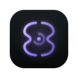

<p align="center">
  
</p>

<h1 align="center">NVX Ancile</h1>

<p align="center">A private AI workspace for serious knowledge work.<br>Chat, notebooks, memory and agents in one place, running on your machine.</p>

---

Ancile is where you think with AI for hours at a time. You chat with any model and switch mid-conversation without losing context. Any message can become a branch, and the branches are drawn as a tree. Files, links and past threads become sources, and answers cite the exact passage they came from. A second model can check any claim. Ancile remembers your preferences and its own past mistakes, keeps that memory as plain markdown under git, and you can read and edit every line. Every answer has a "why" view: the memory, sources, models, fallbacks and permission decisions behind it.

Your data stays on your machine. Remote GPUs are optional and ephemeral, and the system controls them for you with costs shown up front.

<!-- Screenshot: the cockpit in dark mode, a notebook thread with citations open in the drawer and the branch tree beside it. Add docs/assets/cockpit-dark.png once Phase 2 renders a real thread. -->

## How it fits together

| Layer | What it does | Where |
|---|---|---|
| **Cockpit** | The app you use: keyboard-first, streaming everything, dark and light. | `apps/cockpit` |
| **Core** | The conductor. Assembles context, injects memory, routes to models with fallbacks, enforces permissions, pauses and resumes agents, and traces it all. | `services/core` |
| **Knowledge** | Notebooks, sources, insights, extraction, chunking, hybrid search, reranking, evidence for fact-checks. Its model follows Open Notebook's notebooks and sources, rebuilt on Postgres. | `services/knowledge` |
| **Agent engine** | The lab: shell, code edits, LSP, subagents and undo, under Core's permissions and models. Built on a fork of opencode. | `vendor/opencode` |
| **Controller** | A separate service for your own compute: starts and stops GPU nodes, routes to the models on them, queues while a node wakes, tracks cost, enforces caps. Ancile works without it. | `services/controller` |

Ancile is built on the best open source rather than from scratch:
- **opencode** (the open-source Claude Code) powers the agent lab.
- **Open Notebook** (the open-source NotebookLM) shaped the knowledge layer, rebuilt on Postgres and pgvector.
- **Odysseus's** workspace architecture is reimplemented from a clean-room spec.
- Tools like gpt-researcher, Crawl4AI, Docling, Speaches and Playwright MCP are integrated rather than rebuilt.

Everything is rebranded, wired into one control plane and improved. Exactly what came from where, and what changed, is in [docs/upstream.md](docs/upstream.md).

How the pieces fit together is in [docs/architecture.md](docs/architecture.md), and every guide is in [docs/](docs/).

## Install

**The desktop app** is the easy way: download the installer for Windows, macOS or Linux from the [releases](https://github.com/Envxsion/nvx_ancile/releases), open it, and NVX Ancile runs every service for you. Nothing else to install: no Node, Python or Docker. Your data stays in your user folder, and its secrets in your system keychain. See [the desktop app](docs/desktop.md).

## Quick start (from source)

You need Node 22.12 or later, pnpm 11, [uv](https://docs.astral.sh/uv/) and git. **No Docker, and no `.env`.**

```bash
git clone <this repo> nvx_ancile && cd nvx_ancile
pnpm i
pnpm start
```

`pnpm start` does the rest:
1. Fetches a pinned, checksum-verified embedded Postgres with pgvector, on first run only.
2. Generates this machine's secrets into `.ancile/secrets.json`.
3. Runs every service's migrations and boot tests.
4. Starts everything with hot reload.

If a boot test fails, startup stops and tells you what is wrong and how to fix it. Open http://localhost:7701 and the first-run setup walks you through models, permissions and your first notebook. You never have to edit YAML.

Postgres keeps running in the background between sessions. `pnpm stop` stops it, and your data in `data/` is kept. To override anything, put it in a `.env`; it always wins over the generated values.

Something not right? `pnpm doctor` checks prerequisites, ports and disk space, and suggests fixes.

The desktop app (`apps/desktop`) packages the same services behind one installer; build it yourself with `pnpm --filter @nvx/ancile-desktop build`. **Docker** remains only for servers and CI: `pnpm up:docker`.

## Repository

```
apps/cockpit            the app (Vite, React 19)
apps/desktop            the desktop app: a Tauri shell that runs every service (Rust)
services/core           conductor, gateway, permissions, memory, runs, traces (Node 22, Hono)
services/knowledge      sources, ingestion, retrieval, evidence (Python 3.12, FastAPI)
vendor/opencode         agent engine (opencode fork), run as a sidecar
services/controller     remote compute lifecycle and routing (Node 22, Hono), deployable on its own
packages/aperture       the NVX design system as carried by Ancile: tokens, the mark, theme
packages/contracts      API, events, config and Controller contract (zod), the single source of truth
packages/resilience     retry, circuit breaker, timeouts, fallback chains
packages/plugin-sdk     write tools as MCP servers, memory providers and panels
plugins/                worked examples
config/                 models, routing, tools, memory, policies, automations (all optional to edit)
prompts/                every prompt Ancile uses, versioned
memory-template/        what a new memory repository starts from
infra/                  Dockerfiles, database init, remote node bootstrap
docs/                   guides, reference and runbooks
tests/                  end-to-end, evals, chaos
```

## Documentation

Start with [getting started](docs/getting-started.md). Then:

- [The desktop app](docs/desktop.md)
- [Architecture](docs/architecture.md)
- [Configuration](docs/configuration.md)
- [Permissions](docs/permissions.md)
- [Memory](docs/memory.md)
- [Branching](docs/branching.md)
- [Fact-checking](docs/factcheck.md)
- [Self-healing](docs/self-healing.md)
- [Observability](docs/observability.md)
- [Remote compute](docs/compute.md)
- [Plugins](docs/plugins.md)
- [API](docs/api.md)
- [Events](docs/events.md)
- [Errors](docs/errors.md)
- [Keyboard and UX](docs/ux.md)
- [Brand](docs/brand.md)
- [Runbooks](docs/runbooks/)

## Open core

This repository is the free product, and it is complete on its own: notebooks, grounded answers, branching, memory, flows, the lab, GPU nodes, self-healing and every admin view work without a licence, and everything built before Pro existed stays free.

The paid Pro features live in a separate private repository, mounted here as a git submodule at `pro/`. That folder is **empty in a normal clone**. Core notices it is missing and runs the free product; nothing else changes. Pro adds:

- **Ask several models at once:** one question fanned out to several models, then a fused answer
- **Teams:** shared workspaces with sign-in through your identity provider
- **Encrypted sync:** your notebooks, threads and memory on every computer, encrypted before they leave
- **GPU fleet:** more than one GPU node, new RunPod pods from the app, start and stop schedules
- **Flow lab:** test a flow against past threads, shadow a live flow, a router that learns from your choices
- **Insights:** where your time, money and models go, from your own history

Pro is turned on with an `NVX-XXXX-XXXX-XXXX` key from [ancile.nvx.sh](https://ancile.nvx.sh). The key is exchanged once for a signed token that is checked offline on every start, the same way as the rest of the NVX family. Usage statistics are separate, anonymous and off until you turn them on: see [telemetry](docs/telemetry.md).

## Credits

Ancile builds on ideas and code from open-source projects, credited in [docs/upstream.md](docs/upstream.md). Each bundled project keeps its own licence file beside its code (`vendor/*/LICENSE`, `services/knowledge/LICENSE.open-notebook`).

NVX Ancile is free software under the GNU General Public License v3.0: see [LICENSE](LICENSE). Please report security issues privately through this repository's GitHub security advisories, not in public issues.

---

<p align="center">A product from nvx.sh</p>
